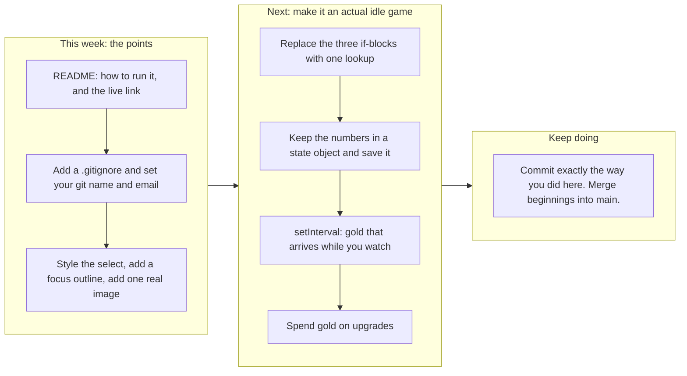

# Project 1: Static Foundations. Feedback for Mark

**Student:** Mark (GitHub `markkubrak`) · **Course:** CSC 436, Fall 2026 · **Reviewed at commit:** [`b0c20c5`](https://github.com/markkubrak/KubraCorpIdle/commit/b0c20c526ff69be1bfbcc57133831e2f493074f6) on the `beginnings` branch
**Repo:** https://github.com/markkubrak/KubraCorpIdle/tree/beginnings · **Live:** https://kubracorpidle.netlify.app/

> **How this review was made.** Your instructor reviewed this project with Claude (Anthropic's AI) as a second set of eyes. Claude cloned the repo, read every line of your HTML, CSS and JavaScript (all 352 of them), ran the W3C validator, loaded the live site at phone, tablet and desktop widths, and played the game: it clicked Generate with each resource, counted the gold, and checked that Mining went from level 1 to level 2 on exactly the tenth copper. It compared the live site to your branch and read all 32 of your commits. Every note and every point below was read and approved by your instructor. The late submission was approved ahead of time and costs nothing.

## Grade: 85 / 100

| Category | Points | Earned | One line |
|---|---|---|---|
| Semantic HTML | 20 | **19** | Validates with zero messages, every element the brief lists, one h1, a clean outline, a real label on the select; the numbers change silently for a screen reader |
| CSS layout | 25 | **22** | Flexbox and Grid both yours and both doing real work, `auto-fit`, `clamp`, hover and press states; no focus outline, and the select is a white box on a dark page |
| Responsive design | 15 | **13** | No horizontal scroll anywhere, resource cards reflow by themselves, skills go 1 to 3 columns; one query faces each direction, and the desktop does not use its width much |
| JavaScript interaction | 15 | **13** | A working game loop: choose, click, count, earn gold, gain XP, level up, all correct; the same block is written three times and nothing is saved |
| Repository and deployment | 15 | **12** | 32 small commits over six days with messages that read like a diary, deploy matches the branch; README is missing how to run it and the live link, no `.gitignore` |
| Content and polish | 10 | **6** | A consistent look and a voice that is clearly yours; no images at all, and not much content yet |
| **Total** | **100** | **85** | You built this yourself, one small step at a time, and it shows in the best way. |

## The short version

Your note said that delaying the submission meant you learned a ton. The commit history backs that up, and it is the best thing in this repo. Thirty-two commits from September 14 to September 19, each one a single small step: "Nav bar with hyperlinks added," "linked the style sheet, added # to links," "the button now actually generates the selected resource," "XP gain now works. Side note: fixed some spelling errors I made in js." Anyone can read that list top to bottom and watch you learn HTML, then CSS, then JavaScript. That is exactly what the brief asked a history to show, and most of the class did not manage it.

The site itself is small and correct. The validator has nothing to say. You used `header`, `nav` with a list, `main`, three `section`s, six `article`s and a `footer`, with one `h1` and headings in order. Flexbox centers the header and the status panel, a Grid with `auto-fit` lays out the resource cards with no media query at all, and a second Grid takes the skills from one column to three. Nothing scrolls sideways at any width. And the game works: I clicked Generate eleven times and had 11 gold, chose copper and clicked ten times and Mining went to level 2 on exactly the tenth click.

The fifteen points that came off are mostly about things you have not met yet, not things you got wrong. There are no images. The README does not say how to run the project or where it lives. The JavaScript says the same five lines three times, and the numbers exist only as text on the page, so a reload wipes your progress. Every one of those is a next step, and the sections below show you the code for each.

## What the numbers looked like

| Check | Result |
|---|---|
| W3C HTML validator | 0 errors, 0 warnings, 0 info |
| Horizontal scroll at 375 / 768 / 1280 px | None |
| Heading order | h1 > h2 > h3, no skipped levels |
| Semantic elements | header, nav (ul of 3, aria-label), main, 3 section, 6 article, footer |
| Form controls | 1 select with a matching `label for`, 1 `button type="button"` |
| Layout | 3 Flexbox containers, 2 Grids (one `auto-fit`, one 1 to 3 columns) |
| Media queries | 2: `min-width: 700px` and `max-width: 600px` |
| Custom properties | 0 (seven colors, typed seventeen times; fine at this size) |
| Focus styles | 0 |
| Generate with Wood selected, 1 click | Wood 1, Gold 1, Woodcutting XP 1, "Gathering: wood" |
| Switch to Copper, 10 clicks | Copper 10, Gold 11, Mining XP 10, **Mining level 2** |
| 5 more clicks | Copper 15, Gold 16, Mining XP 15, still level 2 |
| Reload | Everything back to 0 (nothing is saved) |
| Console errors | 0 (one `console.log` per click is still in the script) |
| Images | 0 |
| Commits | 32 on `beginnings`, Sep 14 to Sep 19; `main` holds only the first README |
| Commit author | "Your Name <you@example.com>" on 31 of 32 |
| README | Title and description; no run instructions, no live URL |
| Live vs repo | Identical to the `beginnings` branch |

---

## Semantic HTML: 19 / 20

### What's working

- **You used the right element for every job.** `header` with the title and a `nav` that holds a real list ([index.html#L12-L23](https://github.com/markkubrak/KubraCorpIdle/blob/b0c20c526ff69be1bfbcc57133831e2f493074f6/index.html#L12-L23)). `main` with three `section`s, each with its own `h2`. An `article` for every resource card and every skill card, each with an `h3`. A `footer`. One `h1`. The validator returns zero messages, which puts you in a small group.
- **The form controls are done properly** ([index.html#L31-L39](https://github.com/markkubrak/KubraCorpIdle/blob/b0c20c526ff69be1bfbcc57133831e2f493074f6/index.html#L31-L39)). The `label` has `for="resourceSelect"` and the `select` has that id, so clicking the words focuses the menu and a screen reader reads them together. The button says `type="button"`. Most people skip both. Your commit "added aria-label, button id, article classes, span ids" shows you went back and did this on purpose.
- Loading the script with `defer` in the `head` ([#L8](https://github.com/markkubrak/KubraCorpIdle/blob/b0c20c526ff69be1bfbcc57133831e2f493074f6/index.html#L8)) is the modern way to do it.

### What to change

- **The numbers change, but only for people who can see them.** When gold goes from 4 to 5, a screen reader says nothing. One attribute fixes that: put `aria-live="polite"` on the paragraph that holds the gold ([#L28](https://github.com/markkubrak/KubraCorpIdle/blob/b0c20c526ff69be1bfbcc57133831e2f493074f6/index.html#L28)), and the browser announces the new value by itself. No JavaScript needed. Try it with VoiceOver (Cmd+F5 on a Mac); it is a good two minutes.
- Small: after a click the page says "Gathering: copper" in lowercase, because the script shows the option's `value` rather than its label. `resourceSelect.selectedOptions[0].textContent` gives you "Copper".

## CSS layout: 22 / 25

### What's working

- **Flexbox and Grid, both written by you, both used for what they are good at.** Flex centers the header and the status panel and spaces the nav with `gap` ([style.css#L21-L37](https://github.com/markkubrak/KubraCorpIdle/blob/b0c20c526ff69be1bfbcc57133831e2f493074f6/style.css#L21-L37)). The resource cards are `repeat(auto-fit, minmax(200px, 1fr))` ([#L97-L104](https://github.com/markkubrak/KubraCorpIdle/blob/b0c20c526ff69be1bfbcc57133831e2f493074f6/style.css#L97-L104)), which means "as many 200 px columns as fit, and share what is left." That one line is why the cards go from three across to one on a phone with no media query. Most students do not find it until much later.
- **The skills section is a neat trick.** You made the `section` itself the grid and told the heading and the intro line to span every column with `grid-column: 1 / -1` ([#L133-L141](https://github.com/markkubrak/KubraCorpIdle/blob/b0c20c526ff69be1bfbcc57133831e2f493074f6/style.css#L133-L141)). That is a real Grid idea, used correctly.
- `main { width: min(1100px, 92%) }` keeps lines readable on a big screen ([#L56-L59](https://github.com/markkubrak/KubraCorpIdle/blob/b0c20c526ff69be1bfbcc57133831e2f493074f6/style.css#L56-L59)), `clamp()` sizes the title ([#L88](https://github.com/markkubrak/KubraCorpIdle/blob/b0c20c526ff69be1bfbcc57133831e2f493074f6/style.css#L88)), and the button really does pop when pressed ([#L172-L174](https://github.com/markkubrak/KubraCorpIdle/blob/b0c20c526ff69be1bfbcc57133831e2f493074f6/style.css#L172-L174)). The brown and gold palette is consistent from the first rule to the last.

### What to change

- **There is no focus style.** Press Tab on your page: the nav links and the button get the browser's default ring, which is nearly invisible on a dark brown background. Add this once and keyboard users can see where they are:

  ```css
  :focus-visible {
    outline: 3px solid #d6a84f;
    outline-offset: 3px;
  }
  ```

- **The select is the one thing you did not style**, so it is a small white system box sitting in the middle of a dark, carefully colored panel. Give it the same treatment as the button: a background of `#35251d`, your cream text color, some padding, a border and a radius. Six lines.
- **The status panel does not use its width on a desktop.** At 1280 px it is an 1100 px wide box with a narrow column of text in the middle. Putting the gold and the current resource side by side above the controls, or the controls beside the numbers, would make the top of the page feel designed.
- Not a deduction at this size, but worth learning now: your seven colors are typed seventeen times. Put them at the top as custom properties (`:root { --gold: #d6a84f; }`) and use `var(--gold)`. When you add a light theme or change your mind about the brown, it becomes one edit.

## Responsive design: 13 / 15

### What's working

- No horizontal scroll at 375, 768 or 1280. The resource grid reflows on its own, the skills go from one column to three at 700 px ([style.css#L186-L190](https://github.com/markkubrak/KubraCorpIdle/blob/b0c20c526ff69be1bfbcc57133831e2f493074f6/style.css#L186-L190)), the nav wraps on a small phone, and the padding tightens up. Everything stays readable and tappable.

### What to change

- **Your two queries face opposite directions** ([#L186](https://github.com/markkubrak/KubraCorpIdle/blob/b0c20c526ff69be1bfbcc57133831e2f493074f6/style.css#L186) and [#L192](https://github.com/markkubrak/KubraCorpIdle/blob/b0c20c526ff69be1bfbcc57133831e2f493074f6/style.css#L192)). One says "at 700 and wider," the other says "at 600 and narrower." The brief asks for mobile-first, which means: write the phone version as your normal rules, then use only `min-width` queries to add things as the screen grows. Move what is inside the `max-width: 600px` block up into the base rules, and put the roomier padding inside a `min-width` query. Same result, one direction, and nothing to reason about between 600 and 700.
- Apart from the skills grid, the desktop is the phone layout with more air. See the status panel note above.

## JavaScript interaction: 13 / 15

### What's working

- **It is a real game loop and it is correct.** You select eleven elements, listen for one click, and change the page in five places. `document.querySelector(\`#${selectedResource}\`)` ([script.js#L17](https://github.com/markkubrak/KubraCorpIdle/blob/b0c20c526ff69be1bfbcc57133831e2f493074f6/script.js#L17)) is clever: you made the option values match the span ids so one line finds the right counter. The level-up rule with `% 10 === 0` ([#L28](https://github.com/markkubrak/KubraCorpIdle/blob/b0c20c526ff69be1bfbcc57133831e2f493074f6/script.js#L28)) is exactly right, and I checked it: Mining went to 2 on the tenth copper and stayed there at fifteen. Zero errors.
- Your commits show you building it in the right order: a test script for the button, then the select, then wiring them together, then gold, then XP, then levels. One working step at a time is how this is done.

### What to change

- **The same five lines appear three times** ([script.js#L25-L47](https://github.com/markkubrak/KubraCorpIdle/blob/b0c20c526ff69be1bfbcc57133831e2f493074f6/script.js#L25-L47)). The wood, copper and fish blocks differ only in two names. When you add a fourth resource you will copy the block a fourth time, and the day you change how levelling works you will have to remember to change it in every copy. Here is the whole handler with one lookup and one small helper. Claude ran this exact code against your live page and it produced the same numbers as yours at every step:

  ```js
  const skillFor = { wood: "woodcutting", copper: "mining", fish: "fishing" };

  function addOne(selector) {
    const el = document.querySelector(selector);
    el.textContent = Number(el.textContent) + 1;
    return Number(el.textContent);
  }

  generateButton.addEventListener("click", () => {
    const resource = resourceSelect.value;
    const skill = skillFor[resource];

    addOne(`#${resource}`);
    addOne("#gold");
    const xp = addOne(`#${skill}XP`);
    if (xp % 10 === 0) addOne(`#${skill}`);

    currentResource.textContent = resourceSelect.selectedOptions[0].textContent;
  });
  ```

  Adding gems is now one entry in `skillFor` and the HTML for its cards.

  ```mermaid
  flowchart TB
    A["Click Generate"] --> B["Read the chosen resource from the select"]
    B --> W["wood: add 1 XP to woodcutting, level up every 10"]
    B --> C["copper: add 1 XP to mining, level up every 10"]
    B --> F["fish: add 1 XP to fishing, level up every 10"]
    W --> X["The same five lines, written three times. A fourth resource means a fourth copy."]
    C --> X
    F --> X
    X --> Y["One lookup instead: wood is woodcutting, copper is mining, fish is fishing. Then one block handles all of them."]
  ```

- **The only copy of your gold is the word on the screen.** Every click reads the text, turns it into a number, adds one and writes it back ([#L19](https://github.com/markkubrak/KubraCorpIdle/blob/b0c20c526ff69be1bfbcc57133831e2f493074f6/script.js#L19)). That works, but it means a reload starts you at zero, and for an idle game that is the feature players notice first. The next step is to keep the numbers in one object, draw the page from it, and save it:

  ```js
  let state = JSON.parse(localStorage.getItem("kubraSave")) || { gold: 0, wood: 0, copper: 0, fish: 0 };

  function save() {
    localStorage.setItem("kubraSave", JSON.stringify(state));
  }
  ```

  Change `state`, call a `render()` that writes it to the spans, call `save()`. Then a reload picks up where you left off.

  ```mermaid
  flowchart LR
    subgraph today["Today: the numbers live in the page text"]
      direction TB
      t1["Click: read the text, turn it into a number, add 1, write it back"] --> t2["The only copy of your gold is the word on the screen"]
      t2 --> t3["Reload: the HTML says 0 again. Progress is gone."]
    end
    subgraph next["Next: the numbers live in one state object"]
      direction TB
      n1["Click: change state.gold, state.wood, state.xp"] --> n2["render writes state to the page. save stores it in localStorage."]
      n2 --> n3["Reload: load reads it back. The game remembers."]
    end
    today --> next
  ```

- Small: take out the `console.log` on [line 49](https://github.com/markkubrak/KubraCorpIdle/blob/b0c20c526ff69be1bfbcc57133831e2f493074f6/script.js#L49) before you ship. It was the right tool while you were building.

## Repository and deployment: 12 / 15

### What's working

- **This is the best hand-written commit history in the class.** Thirty-two commits over six days, each one small, each message saying what changed in your own words, including the honest ones: "went a lil crazy adding in background colors, borders, padding, margins," "accidentally made this file at the start. Gone now." Keep doing exactly this. It is a professional habit and you already have it.
- The live site is public and matches your branch exactly.

### What to change

- **The README is missing two of the four things the brief asks for** ([README.md](https://github.com/markkubrak/KubraCorpIdle/blob/b0c20c526ff69be1bfbcc57133831e2f493074f6/README.md)). You have a title and a good description. Add how to run it ("Clone the repo and open `index.html` in a browser") and the live link. Put a `#` in front of the first line so GitHub shows it as a heading. Five minutes, and it is two of the three points that came off here.
- **Your work is on a side branch and `main` is empty.** Someone who visits the repo sees a README and nothing else, because GitHub shows `main` by default. Once you are happy with `beginnings`, merge it: `git checkout main`, `git merge beginnings`, `git push`. Branches are great; just bring the work home when it is done.
- **Git does not know who you are.** Thirty-one of your commits are signed "Your Name <you@example.com>", which is the placeholder from a tutorial. Run these once and every future commit carries your name:

  ```bash
  git config --global user.name "Mark Kubrak"
  git config --global user.email "the email on your GitHub account"
  ```

- Add a `.gitignore` with `.DS_Store` and `.vscode/` in it. You have nothing to ignore yet, which is why nothing went wrong, but it is the first file in every real project.

## Content and polish: 6 / 10

### What's working

- The page has a voice. "It's resource gathering time, baby." "The mines, you yearn for them." "White whale, holy grail." That is yours, and it makes a tiny game feel like somebody made it. The dark wood palette fits the theme and is applied consistently, and the hover and press feedback makes the one button satisfying to click.

### What to change

- **There are no images.** The brief asks for real images with alt text, and this is the largest single deduction on the page. It is also an easy and fun fix: a small icon for wood, copper and fish in each resource card (free ones at [game-icons.net](https://game-icons.net), or draw your own), each with `alt="Wood"`. Three images and the page looks like a game.
- **There is not much here yet.** Three short sections and one button. You said in your README that this is a foundation, and it is a good one, but a visitor runs out of things to do in about a minute. See the roadmap: saving, idle income and one upgrade would triple how long someone stays.

---

## Your next moves



1. **Finish the paperwork.** README, `.gitignore`, your git name, merge into `main`. Half an hour, and none of it is hard.
2. **Three images, a styled select, a focus outline.** The page goes from a good skeleton to something that looks finished.
3. **Then the fun part.** One lookup, one state object, `localStorage`, and a `setInterval` that pays you a little gold every second. That last one is what makes it an *idle* game, and it is about six lines.

*This review lives in a pull request on your repo, against your `beginnings` branch. It only adds files under `feedback/` and does not touch your code. Merge it, close it, or just read it. Questions go to office hours or the Brightspace board. Welcome back to coding, Mark. You clearly have not lost the instinct for doing it one careful step at a time.*
